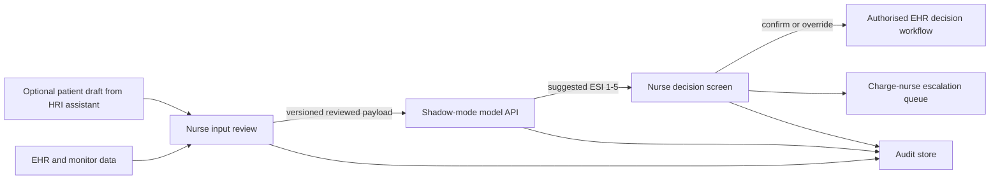

# Deployment System Requirements

- **System:** Clinician-in-the-loop emergency triage decision support
- **Deployment stage:** Shadow-mode pilot
- **Owner:** Terry Benjamin Jr.
**Version:** 1.0, 4 August 2026

## 1. Purpose and scope

The proposed system gives an emergency triage nurse a model-suggested ESI level
after the nurse reviews the available intake data. It supports, rather than
automates, the clinical decision. The Week 9 design also explores an optional
stationary HRI assistant that can collect a patient-reviewed complaint draft
and accessibility preferences before nurse assessment.

The deployment baseline covers the HCI workstation, the HRI intake concept,
EHR and monitor data routing, a versioned model endpoint, nurse confirmation or
override, audit logging, outage handling, access control, and pilot monitoring.

### Out of scope

- autonomous diagnosis, triage, treatment, medication, or resource allocation
- direct model write to the final ESI field
- autonomous robot navigation or moving manipulators
- patient-facing ESI, risk score, confidence score, or treatment advice
- replacement of existing EHR downtime and emergency escalation procedures

## 2. Users and operating context

| User | Required capability |
| --- | --- |
| Triage nurse | Review source data, request a suggestion, confirm or override, continue manually, and correct a decision before encounter close. |
| Charge nurse | Review high-acuity pending cases, audit exceptions, and verify escalation without silently changing the original nurse's record. |
| Patient or caregiver | Choose whether to use the HRI assistant, select language and access mode, correct or erase a draft, and summon a nurse. |
| Clinical IT | Configure interfaces, identity, approved devices, logs, downtime, and version deployment. |
| Biomedical engineering and infection prevention | Approve HRI physical placement, device health, emergency stop, cleaning method, and cleaning audit. |
| Clinical governance | Approve pilot scope, residual risk, model version, monitoring thresholds, and pause criteria. |

The system must remain usable during high noise, interruptions, fatigue, glare,
queue pressure, partial device failure, and unstable network or power.

## 3. Proposed architecture

The model response cannot call the EHR write interface. Only an authenticated
nurse action can create the final triage decision.

## 4. Functional requirements

| ID | Requirement | Acceptance criterion |
| --- | --- | --- |
| FR-01 | Retrieve the current encounter, complaint, arrival mode, age, vital signs, glucose, oxygen context, source, and collection time from authorised interfaces. | A test encounter displays each configured field with source and timestamp; missing interfaces are named rather than silently omitted. |
| FR-02 | Let the nurse review and correct an imported value while retaining the original value and source. | A correction is visible before model request and both original and corrected values appear in the audit record. |
| FR-03 | Validate required, stale, and out-of-range inputs before a model request. | Missing or invalid required data disable the request and identify the field. Manual triage remains reachable within two actions. |
| FR-04 | Send only the reviewed feature schema with encounter token, schema version, and model version to the model endpoint. | Contract tests reject unknown schema versions and log the accepted version without patient names. |
| FR-05 | Display one suggested ESI level from 1 to 5 using number, urgency text, and redundant colour. | A nurse can identify the suggestion in colour and monochrome tests. No patient-level confidence or causal statement appears. |
| FR-06 | Require an authenticated nurse to confirm or override before final ESI write. | No final ESI is written from model response or page load alone. |
| FR-07 | Capture override ESI, reason, optional note, user, and time. | Every override has a valid ESI and reason and remains distinguishable from the model suggestion. |
| FR-08 | Preserve a pending state when no action is taken. | The system never auto-assigns ESI. ESI 1 or 2 creates one reminder and a charge-nurse queue entry after the configured interval. |
| FR-09 | Support correction until encounter close while retaining prior entries. | An authorised correction creates a new event and does not overwrite the earlier event. |
| FR-10 | Provide explicit EHR, model, and audit unavailable states without showing a stale suggestion as current. | Failure injection produces the correct state and preserves the manual clinical route. |
| FR-11 | Ask HRI users for consent, language, and input mode before complaint capture. | Decline and nurse-call paths work without reducing queue position or requiring further HRI input. |
| FR-12 | Read back and display each HRI-captured answer for correction. | Low-quality speech requests clarification. Unconfirmed text is marked draft and is not sent to the model. |
| FR-13 | Let an HRI user change, erase, or send the draft to the nurse queue. | Erase removes the unsent draft; send includes consent, input mode, times, and device-health state. |
| FR-14 | Block HRI use when physical safety, cleaning, microphone, screen, nurse-call, or health checks fail. | Startup and scheduled health checks route the patient to a nurse and log the failed component. |

## 5. Non-functional requirements

| ID | Requirement | Pilot target and verification |
| --- | --- | --- |
| NFR-01 | Performance | P95 model response at or below 2 seconds on the hospital network; input review and manual fallback do not wait for the model. Measure with timestamped pilot logs. |
| NFR-02 | Availability | HCI decision support target 99.5% during pilot hours. HRI availability is monitored separately and never gates nurse triage. |
| NFR-03 | Reliability | Fail closed for model, write, audit, and HRI health errors. A stale response cannot be labelled current. Verify by fault injection. |
| NFR-04 | Accessibility | WCAG 2.2 AA contrast, keyboard-operable HCI controls, 16 px minimum primary text, colour-redundant meaning, HRI captions, adjustable display and volume. Test with approved devices and users. |
| NFR-05 | Usability | At least 90% of representative nurses complete each scenario without assistance; 100% identify model suggestion versus final human decision. |
| NFR-06 | Security | Encryption in transit and at rest, role-based access, least privilege, managed identity, no shared accounts, and no secrets in source control. Verify through security review. |
| NFR-07 | Privacy | Use encounter tokens and minimum necessary fields. HRI camera remains physically shuttered off for the pilot; unsent drafts expire after the approved timeout. |
| NFR-08 | Auditability | Append-only events include user, source, model and schema versions, inputs, suggestion, final decision, reason, timestamps, device state, and correlation ID. |
| NFR-09 | Maintainability | Configuration, schema, model version, thresholds, and escalation interval are version controlled and reviewed through pull requests. |
| NFR-10 | HRI physical safety | Stationary locked base, rounded edges, marked clearance, accessible emergency stop, approved electrical inspection, and no autonomous movement. |
| NFR-11 | HRI infection control | Approved wipeable materials, visible cleaning state, documented cleaning interval, and automatic lockout when cleaning is overdue. |
| NFR-12 | HRI audio quality | Push-to-talk capture, captions, read-back, and a measured threshold that triggers clarification rather than silent transcription. Test in recorded ED noise. |

## 6. Integration requirements

| ID | Interface | Requirement |
| --- | --- | --- |
| IR-01 | EHR read | Use the hospital-approved integration layer, preferably FHIR R4 resources or the local equivalent, for encounter and observation data. Do not screen-scrape the clinical record. |
| IR-02 | Device data | Reconcile monitor values to encounter, source, unit, and collection time. A device feed cannot silently replace a nurse-corrected value. |
| IR-03 | Model API | Authenticated, versioned request and response schema with timeouts, idempotency key, correlation ID, and no direct clinical write privilege. |
| IR-04 | Decision write | Use the authorised EHR workflow after nurse action. Return success, failure, and retry state to the nurse. |
| IR-05 | Audit store | Append-only store available to governance and technical audit roles, with retention approved by hospital policy. |
| IR-06 | Escalation queue | Create one high-acuity pending event and avoid duplicate reminders. Acknowledgement does not change the final ESI. |
| IR-07 | Identity | Hospital identity provider with role mapping, session timeout, and reauthentication for sensitive corrections. |
| IR-08 | HRI handoff | Send an unverified draft and device state to the nurse queue. Do not route the draft directly to the model or final record. |

## 7. Data and audit contract

The minimum audit event includes encounter token, event type, source system,
source and corrected values, units, collection times, schema version, model
version, model suggestion, final nurse decision, override reason, user role,
timestamps, HRI consent and input mode when applicable, device-health state,
and correlation ID.

Patient names, credentials, raw audio, and unrelated record fields are excluded
from the pilot audit. Raw HRI audio is not retained unless a separately approved
study protocol and consent process require it.

## 8. Fallback and recovery

| Failure | User-facing response | Required recovery |
| --- | --- | --- |
| EHR pull unavailable | Name the unavailable source, retain entered values, unlock manual entry. | Continue standard triage; retry only on user action. |
| Required value missing | Name the field and keep model request disabled. | Measure or record the value, or proceed without model support. |
| Model timeout or error | Show "Model unavailable" and no stale suggestion. | Continue normal triage and log the failed request. |
| Decision write failure | Keep the nurse's decision visible as unsaved. | Retry through authorised workflow or follow downtime documentation. |
| Audit write failure | Do not present the event as fully recorded. | Queue a protected retry and follow downtime procedure if retry fails. |
| HRI health, power, audio, cleaning, or network failure | Stop HRI intake, preserve nurse-call function where safe, and direct the patient to staff. | Quarantine the device until the owning team clears the failed control. |

## 9. Verification plan

1. Contract tests for EHR, device, model, write, audit, identity, and HRI handoff.
2. Fault injection for missing data, stale data, timeout, partial write, lost
   network, power warning, failed microphone, overdue cleaning, and emergency
   stop.
3. Scenario-based usability tests with triage and charge nurses.
4. Accessibility review in keyboard, colour-blind simulation, glare, captions,
   seated reach, and language handoff scenarios.
5. Security and privacy review of permissions, logging, retention, and device
   physical ports.
6. Shadow-mode monitoring by ESI class, including ESI 1 misses, disagreement,
   overrides, latency, failures, subgroup performance, HRI abandonment, and
   nurse-call use.

## 10. Pilot entry and exit criteria

The pilot starts only after interface tests pass, clinical and technical owners
sign the safety controls, staff complete training, and downtime procedures are
tested. It pauses for any patient harm, unauthorised write, repeated stale data,
unresolved security event, unsafe HRI physical behaviour, or a governance-set
under-triage threshold breach.

Expansion requires acceptable usability, availability, latency, override,
subgroup, and ESI 1 safety results, plus formal acceptance of the documented
residual risk. Meeting a metric does not itself authorise autonomous use.
